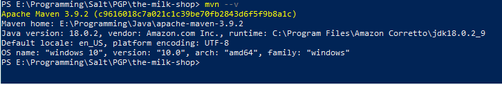

# The Milk Shop

The Milk Shop Application allows the users to search, filter, select and order the preferred type and/or brand of milk. 

##  Table of content
- [User Experience (UX)](#user-experience--ux-)
- [Technologies used](#technologies-used)
- [Features](#features)
- [Testing](#testing)
- [Deployment](#deployment)
- [Credits](#credits)

## User Experience (UX) 
### How to run the application:
- Download and unzip Maven from the official website: https://maven.apache.org/download.cgi
- Add the System Enviroment Variable (EV)
  - Variable Name: MAVEN_HOME, value: the path of Maven folder (i.e E:\Programming\Java\apache-maven-3.9.2)
  - Edit the Path EV and add %MAVEN_HOME%\bin (for windows)
- Verify Maven is installed correcly:
  - Open a terminal and type "mvn --v" (or mvn -version)
  

## Technologies used 
### languages
- Java: BE
- Relational DB: H2 embedded DB
- Next.js: FE
- Typescript: FE development tool
- CSS: style
### Frameworks, Libraries & Programs Used
- Spring Boot
- JPA

## Features
### User:
- As Anonymous, users can check the news in the landing page, check for the advice about rats pets (environment, food, etc) and contacts the volounteers.
- As Registered, same as anonymous and can chat with other users and volounteers.
- As Adopters, same as registered but can chat with other adopters and have access (read) to the adopted rats and can contact vets directly.
- As Owner (pet seller) can register the rats owned to keep track and have access to statistic (all data will be available to volounteers).
- As Volounteers, same as adopters but have full control over DB (CRUD) and have access to statstic (avg age, mortality, common diseases, etc).

## Development
The project is still in rel1.0, but below are shown the future development
- Rel 1.0 to 1.2 is meant to be used as a tool for recording the rescue of the rats
- Rel 1.3 and 1.4 is meant to integrate information about clinics and vets for helping volounteers and adopters to manage and take care fo the rats
- Rel 2.0 is meant to be a web  application for users to get informations about rats and looking for pets to be adopted.

# Status of development: Rel 1.2

## Deployment 

## Flow

## Credits
- On the website of the  [w3schools](https://www.w3schools.com/)
- On the website of the  [Baeldung](https://www.baeldung.com/)
- On School of Applied Technology [/SALT](https://www.salt.study/our-hubs/stockholm) That gave me the chance to learn how to plan and create a web application from scratch.
