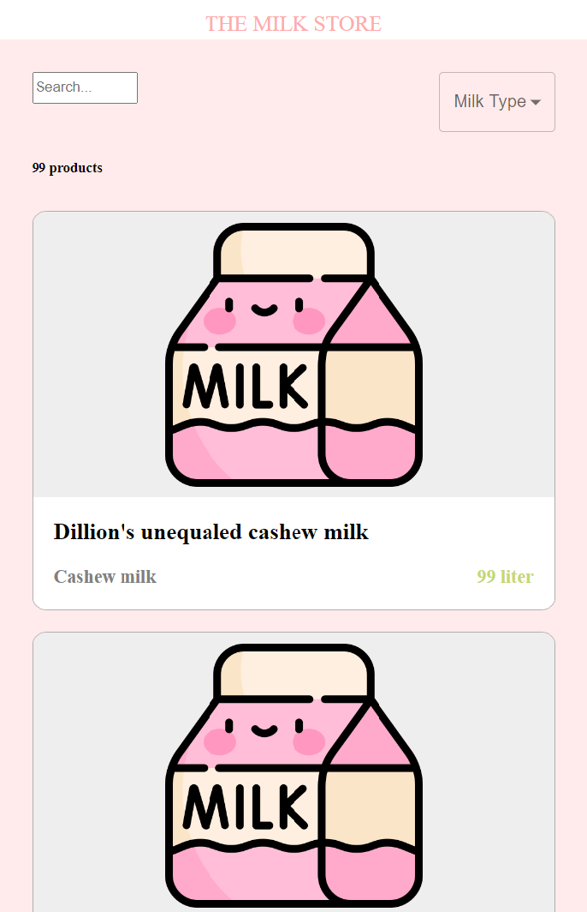
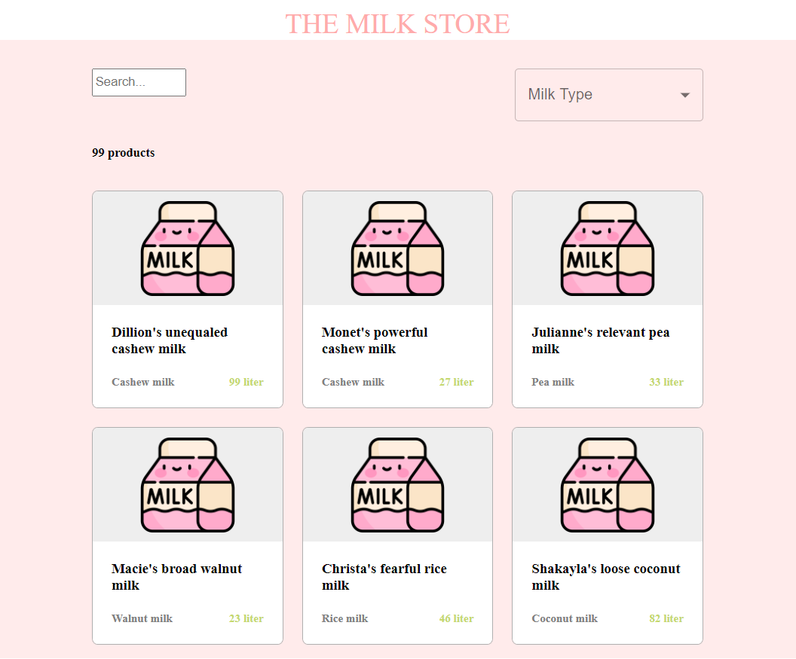

# The Milk Shop

The Milk Shop Application allows the users to search, filter, select and order the preferred type and/or brand of milk. 

##  Table of content
- [User Experience (UX)](#user-experience--ux-)
- [Technologies used](#technologies-used)
- [Features](#features)
- [Development](#development)
- [Credits](#credits)

## User Experience (UX) 
### How to run the application:
### Get Maven:
- Download and unzip Maven from the official website: https://maven.apache.org/download.cgi
- Add the System Enviroment Variable (EV)
  - Variable Name: MAVEN_HOME, value: the path of Maven folder (i.e E:\Programming\Java\apache-maven-3.9.2)
  - Edit the Path EV and add %MAVEN_HOME%\bin (for windows)
- Verify Maven is installed correcly:
  - Open a terminal and type "mvn --v" (or mvn -version)
  ```
  PS E:\Programming\Salt\PGP\the-milk-shop> mvn --v
  Apache Maven 3.9.2 (c9616018c7a021c1c39be70fb2843d6f5f9b8a1c)
  Maven home: E:\Programming\Java\apache-maven-3.9.2
  Java version: 18.0.2, vendor: Amazon.com Inc., runtime: C:\Program Files\Amazon Corretto\jdk18.0.2_9
  Default locale: en_US, platform encoding: UTF-8
  OS name: "windows 10", version: "10.0", arch: "amd64", family: "windows"
  ```
### Run the BackEnd:
- Go to the backend folder root:
  - <Path on disk>\the-milk-shop\backend>
- type "mvn spring-boot:run"
  - If there are no error, after a while the server will show
  ```
  : ControllerAdvice beans: 1 @ExceptionHandler, 1 ResponseBodyAdvice
  : Tomcat started on port(s): 8080 (http) with context path ''
  : Started TheMilkShopApplication in 5.213 seconds (process running for 5.679)
  : Application availability state LivenessState changed to CORRECT
  : Application availability state ReadinessState changed to ACCEPTING_TRAFFIC
  ```
  
 ### Run the FrontEnd: 
 - Go to the frontend folder root:
  - <Path on disk>\the-milk-shop\frontend>
- install dependenice: "npm install"
- type "npm run dev"
  - If there are no error, after a while the server will show
  ```
  - ready started server on 0.0.0.0:3000, url: http://localhost:3000
    (node:12644) ExperimentalWarning: The Fetch API is an experimental feature. This feature could change at any time
    (Use `node --trace-warnings ...` to show where the warning was created)
  - event compiled client and server successfully in 1254 ms (173 modules)
  ```
  
 ### Use the applicaion:
 - Go to http://localhost:3000/ to land on the main page:
  - The mobile version:
    
  - The tablet version:
    
  - The desktop version:
    
  - Milk details where user can order:
    
  
## Technologies used 
### languages
- Java: BE
- Relational DB: H2 in-mem DB (MongoDB for deployment)
- Next.js: FE
- Typescript: FE development tool
- CSS: style
### Frameworks, Libraries & Programs Used
- Spring Boot
- JPA
- MUI

## Features
### User:
- User can search for a specific prodcuct by name
- User can filter for type of milk
- User can inspect the milk product and order an amount of milk in a range between 1 and the availability in the storage. After the order the amont available in storage change.

## Development
- Future features:
  - Implementig a cart in order to order more products at once
  - Deploy the application
  - Improve the the style

## Credits
- On the website of the  [w3schools](https://www.w3schools.com/)
- On the website of the  [Baeldung](https://www.baeldung.com/)
- On School of Applied Technology [/SALT](https://www.salt.study/our-hubs/stockholm)
- On Material UI [/MUI](https://mui.com/)
